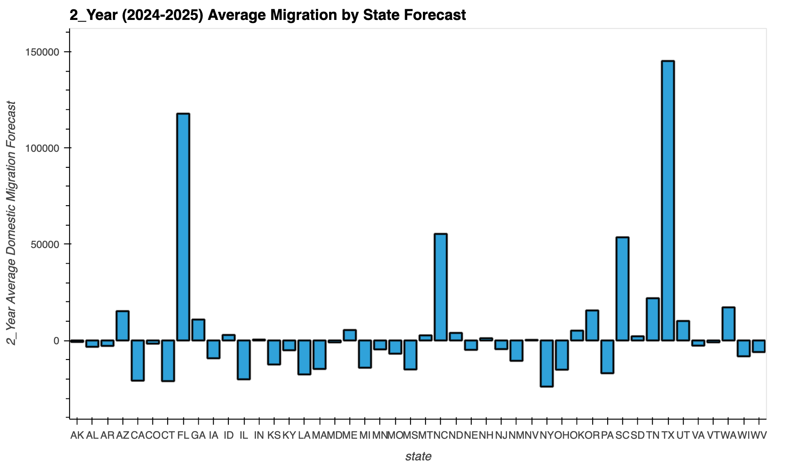
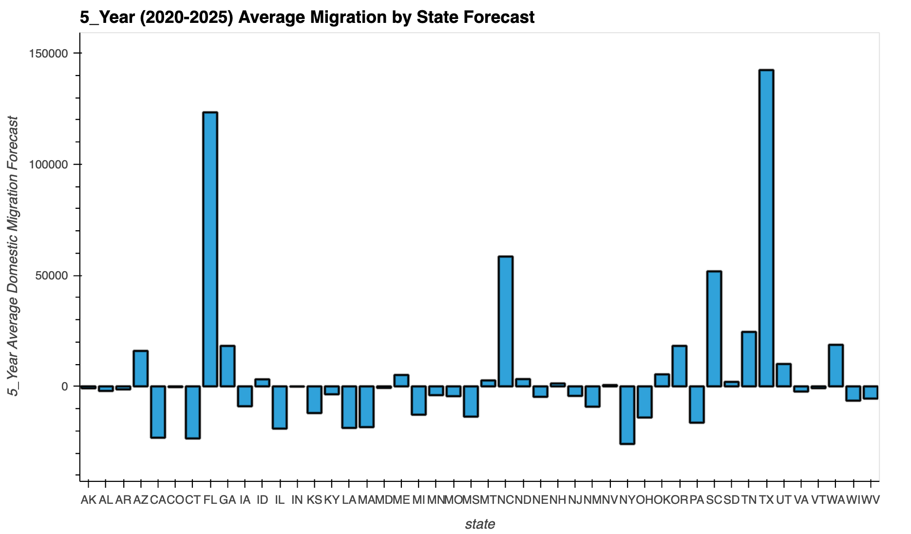
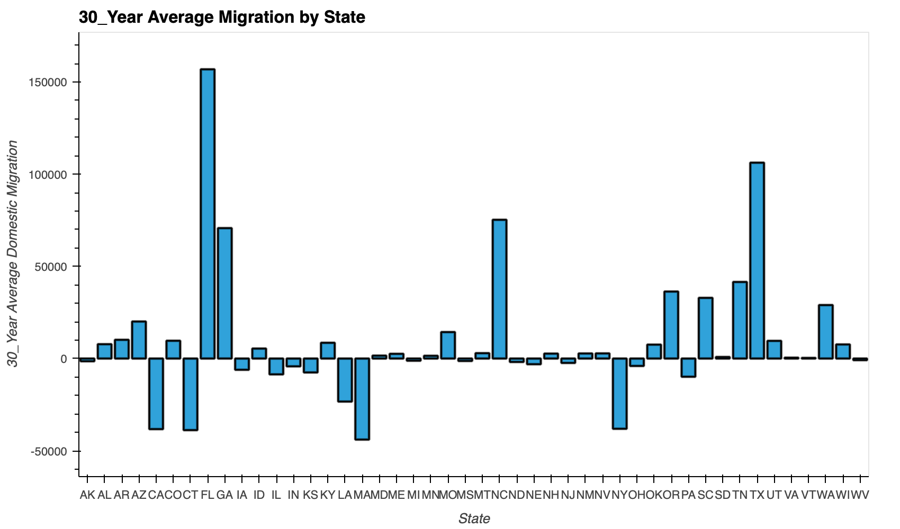
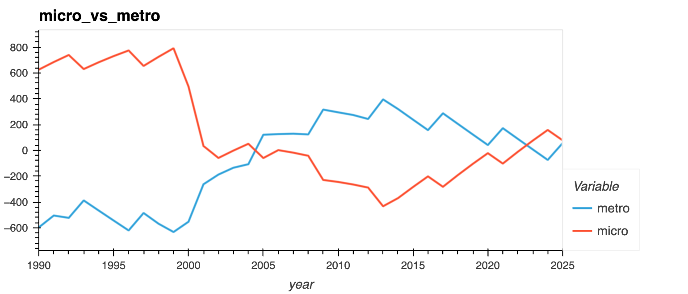

# FinTech Project 2

## Team Members:
## Kerim Muhammetgylyjov
## Jacquelin Chavez
## Emmanuel Ngoli
## Jonathan Frazure

# Domestic Migration Trend Modeling & 5 Year Forward Look

We are building 3 different machine learning models to analyze 30 years domestic migration change data from state to state within the United States, as well as several key metro areas in particular states where observable movements seem to exist.  We will take the results of the three separate methodologies (Naive Byes, K Nearest Neighbors, and Decision Tree) and compile a detailed comparison of the results.  We are also running a prediction algorithm via Prophet for 5 years forward from 2020 where our dataset ends.

The datafile that we are utilizing comes from a group of files under "Components of Population Change" found on the website statsamerica.org.  We hope that our analysis will provide a clearer picture of population movements over the last 20 years as well as a forward look of how population demographics could change out to the year 2025.

## https://www.statsamerica.org/Default.aspx

The following project guidelines focus on teamwork, your project proposal, data sources, and data cleanup and analysis.

# Support and Resources

Your instructional team will provide support during classes and office hours. You also have access to learning assistants and tutors to help you with topics for which you need additional help. Be sure to take advantage of these resources as you collaborate with your group on this second project.
# Technical Requirements for Project 2

The following sections outline the technical requirements for Project 2.
# Software Version Control (10 points)
### Repository is created on GitHub. (2 points)
### Files are frequently committed to repository. (3 points)
### Commit messages include an appropriate level of detail. (2 points)
### Repository is organized and includes relevant information and project files. (3 points)

# Data Collection and Preparation (10 points)
### Data is collected from CSV files, APIs, or databases by using Python or a Python library. (5 points)
### Data is cleaned and prepared for the application or analysis by using Python or a Python library. (5 points)

# Machine Learning (40 points)
### Jupyter notebook, Google Colab notebook, or Amazon SageMaker Studio notebook is created to prepare training and testing datasets. (5 points)
### One or more machine learning models are created. (5 points)
### Models are fit to the training data. (5 points)
### Trained models are evaluated by using the testing data, and calculations, metrics, or visualizations that are needed to evaluate the performance are included. (10 points)
### Predictions are provided by using a sample of new data, and the predictions are compared if more than one model was used. (3 points)
### Visualizations in the form of PNG files are saved for two purposes: to distribute to the class and the instructional team and to include in your presentation and the README.md file for your repo. (2 points)
### One new machine learning library, machine learning model, or evaluation metric is used that the class hasn't already covered. (10 points)

# Documentation (15 points)
### Code is well commented with concise, relevant notes. (5 points)
### GitHub README.md file includes a concise project overview. (2 points)
### GitHub README.md file includes detailed usage and installation instructions. (3 points)
### GitHub README.md file includes either examples of the application or the results and a summary of the analysis. (5 points)

# Presentation Requirements (25 points)
## Each project group will prepare a formal 10-minute presentation that includes the following:
### An executive summary of the project and project goals. (5 points)
### Explain how this project relates to fintech and machine learning.
### The selected model. (5 points)
### Describe the machine learning model that your group selected and why.
### The data preparation and model training process. (3 points)
### Describe the source of your data and why you chose it for your project.
### Describe the collection, cleanup, and preparation process.
### Describe the training process.
### The approach that your group took to achieve the project goals. (5 points)
### Include any relevant code or demonstrations of the machine learning model.
### Describe the techniques that you used to evaluate the performance of the model.
### Discuss any unanticipated insights or problems that arose and how you resolved them.
### The results and conclusions from the machine learning model or application. (5 points)
### Include relevant images or examples to support your work.
### If the project goal wasn’t achieved, share the issues and what the group tried for resolving them.
### Next steps. (2 points)

# Order of Presentation

### -- Cover lower level machine learning models covered in the assignment - Naive Byes, Decision Tree, and K Nearest Neighbors.

### -- Relate the outputs from the aforementioned in terms of data convergence or divergence.

### -- Work carefully through the Prophet Model and the prediction graphs and plots to discuss the differences in the states gaining and losing population in any profound fashion.

### -- Highlighted Metro Areas thus far are from the states of Texas, California, New York and Florida.  We all know the existing narratives around who is gaining and losing populations here.  Let's look at the data produced by the models.

### -- Are the narratives that the Upper Midwest region of the USA as well as the far West Coast region are all losing population to the Lower Midwest and Southern states?  Let us look at what the data says.

### -- We all know that COVID skewed migration data in a huge way.  Do the normalized sort of results produced by our models represent the post-COVID realities?  Or is there still a skew in the real migration left over?

### -- Discuss the future possibilities based on the data and what we know currently in 2024.

Python 3 (ipykernel)
# Imports
import pandas as pd
import numpy as np
from pathlib import Path
import hvplot.pandas
import matplotlib.pyplot as plt
from sklearn import svm
from sklearn.preprocessing import StandardScaler
from pandas.tseries.offsets import DateOffset
from sklearn.metrics import confusion_matrix, accuracy_score, classification_report

# Ignore warnings
import warnings
warnings.filterwarnings('ignore')
# Create a Path and Read csv file 
migration_df = pd.read_csv(Path('Resources/state_to_state.csv'))
migration_df

# Group by the 'State' column
#grouped_by_state = migration_df.groupby('State')

# Calculate the mean
#by_state = grouped_by_state.sum()

# Slice and Drop columns
slice_year = migration_df[(migration_df['Year'] >= 1990) & (migration_df['Year'] <= 2024)]
slice_year = slice_year.drop(['District Name','IBRC_Geo_ID'], axis=1)
slice_year

# Group by 'State' and 'Year' columns and calculate the mean
grouped_df = slice_year.groupby(['State', 'Year']).sum()
grouped_df = grouped_df.reset_index()

# Plot 
import hvplot.pandas
grouped_df.hvplot(groupby='State',
                  x='Year', 
                  y='Net Domestic Migration',
                  xlabel='Year', 
                  ylabel='Domestic Migration',
                  line_width=2.0,    
                  width=750,        
                  height=400,
                  title='Domestic Migration Change by State').opts(yformatter='%.0f',
                                      active_tools=[])
                                      
# Calculate mean of all States for the last 30 years
sum_by_state = grouped_df.groupby('State')['Net Domestic Migration'].mean().reset_index()

#Plot
sum_by_state.hvplot.bar(
    x='State',
    y='Net Domestic Migration',
    xlabel='State',
    ylabel='30_Year Average Domestic Migration',
    title='30_Year Average Migration by State',
    line_width=2.0,    
    width=850,        
    height=500        
).opts(yformatter='%.0f', active_tools=[])

# Create the target, of State populations either growing or declining
grouped_df['Target'] = np.where(grouped_df['Net Domestic Migration'] >= 0, 'Yes', 'No')
grouped_df.loc[172:400]

# Segment the features from the target
y = grouped_df['Target']
X = grouped_df.drop(['Target'], axis =1 )

# Run get dummies to the specified column
X = pd.get_dummies(X, columns=['State','Year'])
X

# Split data into default 75% Train and 25% Test 
from sklearn.model_selection import train_test_split
X_train, X_test, y_train, y_test = train_test_split (X, y)
X_train

# Instantiate a StandardScaler instance
scaler = StandardScaler()

# Fit the training data to the standard scaler
X_scaler = scaler.fit(X_train)

# Transform the training data using the scaler
X_train_scaled =  X_scaler.transform(X_train)

# Transform the testing data using the scaler
X_test_scaled = X_scaler.transform(X_test)
X_test_scaled

# Create the model, fit and predict 
from sklearn.naive_bayes import GaussianNB
gnb = GaussianNB()
naive_bayes_pred = gnb.fit(X_train_scaled, y_train).predict(X_test_scaled)

# Print classification reports
print(classification_report(y_test, naive_bayes_pred))

# Create and save the confustion matrix for the training data
naive_bayes_matrix = confusion_matrix(y_test, naive_bayes_pred)

# Print the confusion matrix for the training data
naive_bayes_matrix
              precision    recall  f1-score   support

          No       0.71      0.88      0.79       171
         Yes       0.86      0.67      0.76       186

    accuracy                           0.77       357
   macro avg       0.79      0.78      0.77       357
weighted avg       0.79      0.77      0.77       357

array([[151,  20],
       [ 61, 125]])
# Import the KNeighborsClassifier module from sklearn
from sklearn.neighbors import KNeighborsClassifier

# Instantiate the KNeighborsClassifier model with n_neighbors = 25
knn = KNeighborsClassifier(n_neighbors=50)

# Train the model using the training data
knn.fit(X_train_scaled, y_train)

# Create predictions using the testing data
y_pred = knn.predict(X_test_scaled)

# Print the classification report comparing the testing data to the model predictions
print(classification_report(y_test, y_pred))

# Create and save the confustion matrix for the training data
KNeighbors_matrix = confusion_matrix(y_test, y_pred)

# Print the confusion matrix for the training data
KNeighbors_matrix
              precision    recall  f1-score   support

          No       0.85      0.68      0.76       171
         Yes       0.75      0.89      0.82       186

    accuracy                           0.79       357
   macro avg       0.80      0.79      0.79       357
weighted avg       0.80      0.79      0.79       357

array([[117,  54],
       [ 20, 166]])
# Creating individual DataFrames for each state based
state_dfs = {}
for state in grouped_df['State'].unique():
    state_df = grouped_df[grouped_df['State'] == state][['Year', 'Net Domestic Migration']]
    state_df['Percentage Change'] = state_df['Net Domestic Migration'].pct_change() * 100
    state_dfs[state] = state_df

for state, state_df in state_dfs.items():
    locals()[f"{state}_df"] = state_df

from sklearn.tree import DecisionTreeClassifier

# Instantiate a DecisionTreeClassifier instance
dt_classifier = DecisionTreeClassifier()

# Train the Decision Tree classifier on the scaled training data
dt_classifier.fit(X_train_scaled, y_train)
# Segment the features from the target
y_2020 = grouped_df['Target']
X_2020 = grouped_df.drop(['Target'], axis=1)

# Perform one-hot encoding if necessary
X_2020 = pd.get_dummies(X_2020, columns=['State', 'Year'])

# Now you can proceed with making predictions for the year 2020-2024
X_2020_scaled = X_scaler.transform(X_2020)
dt_pred_2020 = dt_classifier.predict(X_2020_scaled)

# Print predictions for the year 2020-2024
print("Predictions for the year 2020-2024 using Decision Tree Classifier:")
print(dt_pred_2020)

# Co-Lab Prophet:

# Imports
## Install and import the required libraries and dependencies
# Install the required libraries
!pip install pystan
!pip install prophet
!pip install hvplot
!pip install holoviews

import numpy as np
import seaborn as sns

# Import the required libraries and dependencies
import pandas as pd
import holoviews as hv
from prophet import Prophet
import hvplot.pandas
import datetime as dt
import numpy as np
import matplotlib.pyplot as plt
%matplotlib inline

import warnings
warnings.filterwarnings('ignore')

# Upload the file into Colab, then store in a Pandas DataFrame

from google.colab import files
uploaded = files.upload()

# Create Path and read csv file
migration = pd.read_csv('state_to_state.csv', infer_datetime_format=True, parse_dates=True)

# Review the first and last five rows of the DataFrame
migration

# Slice time series
slice_year = migration[(migration['Year'] >= 1990) & (migration['Year'] <= 2020)]

# Group by the 'State' column and calculate sum by state
grouped_df = slice_year.groupby(['State', 'Year']).sum()
# Reset the index
grouped_df = grouped_df.reset_index()

# Creating individual DataFrames for each state
# Create empty dictionary to store and run for loop
state_dfs = {}
for state in grouped_df['State'].unique():
    state_df = grouped_df[grouped_df['State'] == state][['Year', 'Net Domestic Migration']]
    state_dfs[state] = state_df

# Run define a function called run_prophet that takes two parameters
def run_prophet(df, state):
    df['ds'] = pd.to_datetime(df['Year'], format='%Y')
    df = df[['ds', 'Net Domestic Migration']]
    df.rename(columns={'Net Domestic Migration': 'y'}, inplace=True)

    # Create Prophet model and fit
    model = Prophet()
    model.fit(df)

    # Make predictions into future
    future = model.make_future_dataframe(periods=5, freq='YS')
    forecast = model.predict(future)

    # Plot forecast for all states and print titles
    #fig = model.plot(forecast)
    #plt.title(f'{state} Migration Forecast')

    return forecast[['ds', 'yhat']]

# Create an empty dataframe to store the merged forecasts
merged_forecasts = pd.DataFrame()

# Run Prophet for each state with for loop and concatenate forecasts into one dataframe
for state, state_df in state_dfs.items():
    state_forecast = run_prophet(state_df, state)
    state_forecast['state'] = state
    merged_forecasts = pd.concat([merged_forecasts, state_forecast])

# Rename columns
merged_forecasts.rename(columns={'ds': 'Year', 'yhat': 'Net Domestic Migration Forecast'}, inplace=True)

hv.extension('bokeh')
# Slice dataframe for forcasted timeframe
merged_forecasts_1 = merged_forecasts[(merged_forecasts['Year'] >= '2020-01-01') & (merged_forecasts['Year'] <= '2025-01-01')]

# Calculate an average by state
sum_by_state = merged_forecasts_1.groupby('state')['Net Domestic Migration Forecast'].mean().reset_index()

# Plot 5 year prediction:
hv.extension('bokeh')
sum_by_state.hvplot.bar(
    x='state',
    y='Net Domestic Migration Forecast',
    xlabel='state',
    ylabel='5_Year Average Domestic Migration Forecast',
    title='5_Year (2020-2025) Average Migration by State Forecast',
    line_width=2.0,
    width=850,
    height=500
).opts(yformatter='%.0f', active_tools=[])

hv.extension('bokeh')
# Slice dataframe for forcasted timeframe
merged_forecasts_2 = merged_forecasts[(merged_forecasts['Year'] >= '2024-01-01') & (merged_forecasts['Year'] <= '2025-01-01')]

# Calculate an average by state
sum_by_state = merged_forecasts_2.groupby('state')['Net Domestic Migration Forecast'].mean().reset_index()

# Plot 2 year prediction:
hv.extension('bokeh')
sum_by_state.hvplot.bar(
    x='state',
    y='Net Domestic Migration Forecast',
    xlabel='state',
    ylabel='2_Year Average Domestic Migration Forecast',
    title='2_Year (2024-2025) Average Migration by State Forecast',
    line_width=2.0,
    width=850,
    height=500
).opts(yformatter='%.0f', active_tools=[])

# Upload the file into Colab, then store in a Pandas DataFrame

from google.colab import files
uploaded = files.upload()

metro_area = pd.read_csv('population_change_metros_micros.csv', encoding='latin1')
metro_area

# Group by and calculate sum
micro_vs_metro = metro_area.groupby(['Year', 'Geography', 'Net International Migration']).sum().reset_index()

# Grab Micro and Metro
micro = micro_vs_metro[micro_vs_metro['Geography'] == 'Micro']
metro = micro_vs_metro[micro_vs_metro['Geography'] == 'Metro']
micro

# Format date and rename columns
micro['ds'] = pd.to_datetime(micro['Year'], format='%Y')
micro = micro[['ds', 'Net Domestic Migration']]
micro.rename(columns={'Net Domestic Migration': 'y'}, inplace=True)

# Create the model
micro_model = Prophet()

# Fit the model
micro_model.fit(micro)

micro_future = micro_model.make_future_dataframe(periods=5, freq='YS')
# Make predictions
micro_forecast = micro_model.predict(micro_future)

# Plot predictions
micro_model.plot(micro_forecast);

# Format date and rename columns
metro['ds'] = pd.to_datetime(metro['Year'], format='%Y')
metro = metro[['ds', 'Net Domestic Migration']]
metro.rename(columns={'Net Domestic Migration': 'y'}, inplace=True)
# Create the model
metro_model = Prophet()

# Fit the model
metro_model.fit(metro)

metro_future = metro_model.make_future_dataframe(periods=5, freq='YS')
# Make predictions
metro_forecast = metro_model.predict(metro_future)

# Plot predictions
metro_model.plot(metro_forecast);

# Grab only date and yhat columns, rename columns
micro = micro_forecast[['ds', 'yhat']]
micro['year'] = micro['ds'].dt.year
micro = micro[['year', 'yhat']]
micro.rename(columns={'yhat': 'micro'}, inplace=True)

# Grab only date and yhat columns, rename columns
metro = metro_forecast[['ds', 'yhat']]
metro['year'] = metro['ds'].dt.year
metro = metro[['year', 'yhat']]
metro.rename(columns={'yhat': 'metro'}, inplace=True)

# Concatenate
micro_vs_metro = pd.concat([df.set_index('year') for df in [metro, micro]], axis=1, join='inner')

# Plot
hv.extension('bokeh')
micro_vs_metro.hvplot( title = 'micro_vs_metro').opts(active_tools=[])

# Project Conclusions:

The conclusions that we all came to upon reviewing all of the data generated from this project is as below:

-- The population inflows/outflows documented in the normalized 5 year prediction window are in line with what we all know has been happening.  Massive inflows into Texas, Florida & the Carolinas seem as though they were inevitable and likely hastened by COVID in the early 2020s.

-- The state of California, the Upper Midwest Region, the Upper Northeast Region, and the poorer southern states are in a state of demographic recession and the effects of it will likely be felt for quite a while going forward without major government policy changes, quality of life improvements, etc.

-- The trend in our micro vs. macro analysis show that select micro areas are likely the sweet spot for investment as there is a lean away from metropolitan areas for those that do not have to be there or can afford to live or commute from there for quality of life reasons.

-- Economic opportunity is set to grow immensely in Texas and California and those seem like sure bets on a statewide basis for any investment in real estate, small businesses or service companies, or even agricultural land.